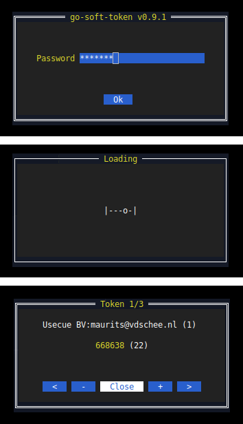

# go-soft-token

A text-based cross-platform "software token" implementation (compatible with Google Authenticator and Microsoft Authenticator) written in Go.
This software uses scrypt for key stretching and AES for TOTP secret storage.

Blog post: https://tqdev.com/2020-free-otp-soft-token-written-in-go

See: https://en.wikipedia.org/wiki/Software_token

### Dependencies

This software is written in Go and uses modules (available in Go 1.11+)

This software uses [gotp](https://github.com/xlzd/gotp) for it's TOTP implementation.

This software has a text user interface (TUI) and uses [tview](https://github.com/rivo/tview/), which is based on [tcell](https://github.com/gdamore/tcell).

### Run and build

To run the software install Go and run:

    go run .

To create an executable, run:

    go build
    
Or to create a release in the `dist` folder, run:

    bash build.sh
    
This automatically increments the build version.

### Download

Go to the [releases](https://github.com/mevdschee/go-soft-token/releases) section to download binaries and source code (click on 'Assets').
